# Project IDEN — Open Source Biometric Identity Provider

An open-source Identity Provider (IDP) with facial biometric authentication, built on the OpenID Connect (OIDC) standard. IDEN provides a complete authentication platform with traditional email/password login, TOTP-based MFA, and facial recognition — all deployable via Docker Compose.

---

## Table of Contents

- [System Architecture](#system-architecture)
- [Component Overview](#component-overview)
- [Authorization Model](#authorization-model)
- [Authentication Assurance (acr / amr)](#authentication-assurance-acr--amr)
- [Component Interactions & Flows](#component-interactions--flows)
- [Database Schema](#database-schema)
- [Provider Internal Architecture](#provider-internal-architecture)
- [Docker Network Topology](#docker-network-topology)
- [Project Structure](#project-structure)
- [Key Design Decisions](#key-design-decisions)
- [Quick Start](#quick-start)
- [Development Phases](#development-phases)

---

## System Architecture

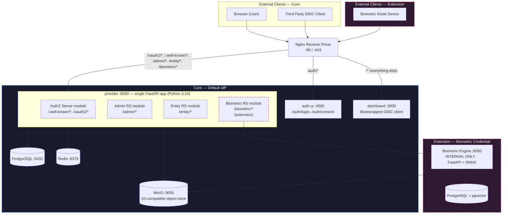

---

## Component Overview

| Component | Tech Stack | Port | Purpose |
|-----------|-----------|------|---------|
| **provider** | Python 3.14, FastAPI, Authlib, asyncpg | 8080 | Single FastAPI app hosting four logical modules: AuthZ Server (`/oauth2/*`, `/.well-known/*`), Admin RS (`/admin/*`), Entity RS (`/entity/*`), Biometric RS (`/biometric/*`) |
| **engine** | Python 3.14, FastAPI, InsightFace, ONNX | 8000 | Internal biometric engine — face detection, embedding, liveness (no external access) |
| **dashboard** | Next.js 15, React, Tailwind CSS | 3000 | Single-page app for both admin and end-user activities (bootstrapped OIDC client) |
| **auth-ui** | Next.js 15, React, Tailwind CSS | 3001 | Login + consent pages — supports password, TOTP, and **biometric (face)** login paths. Hosted UI invoked by `/authorize`. |
| **kiosk** | Hardware + Next.js / native | n/a | Biometric kiosk device — uses `client_credentials` grant to call `biometric-api` |
| **postgres** | PostgreSQL 16 + pgvector | 5432 | Persistent storage for users, clients, tokens, embeddings, scopes |
| **redis** | Redis 7 | 6379 | Sessions, login/consent challenges, rate limits |
| **minio** | MinIO (S3-compatible) | 9000 | Blob storage for files — enrollment/verification images, profile photos, audit snapshots. Keeps large binaries out of Postgres. |
| **nginx** | Nginx Alpine | 80/443 | Reverse proxy, TLS termination, path-based routing |

---

## Authorization Model

IDEN uses **fine-grained scopes embedded in access tokens** for all API authorization. We deliberately do **not** use RBAC at the resource-server layer (unlike Keycloak):

- **Scopes describe APIs**, not users. Examples: `admin:clients:read`, `admin:kiosks:write`, `entity:profile:read`, `entity:totp:enroll`, `biometric:verify`.
- **Roles only gate scope issuance.** When a user authenticates and the AuthZ Server mints a token, it filters the requested scopes against what the logged-in user's role permits. Resource servers themselves never inspect roles — they only check the scopes present in the token.
- **Scopes are not user-creatable.** The set of scopes is fixed by IDEN and corresponds 1:1 to the APIs exposed by the admin / entity / biometric resource servers. There is no `/admin/scopes` *create* endpoint — the `/admin/scopes` API is read-only metadata.
- **The Dashboard SPA requests broad scopes.** Because it serves both admin and end-user use cases, it asks for many scopes during `/authorize`. The AuthZ Server prunes the granted scope set per the user's role at token issuance. A non-admin user receives a token with only entity scopes, even if admin scopes were requested.

This keeps resource servers stateless with respect to identity — they only validate `scope` and `sub` claims.

---

## Authentication Assurance (acr / amr)

IDEN supports multiple authentication methods — password, TOTP, and **facial biometric** — and reports them to relying parties using the two standard OIDC id-token claims:

- **`amr`** (Authentication Methods References, [RFC 8176](https://datatracker.ietf.org/doc/html/rfc8176)) — an array naming the methods actually used. IDEN emits values from a fixed set:

  | `amr` value | Meaning |
  |---|---|
  | `pwd` | Password |
  | `otp` | TOTP (RFC 6238) |
  | `face` | Facial biometric match (liveness-verified) |
  | `mfa` | Present whenever two or more of the above were used |

- **`acr`** (Authentication Context Class Reference) — a single string naming the assurance *level*. IDEN defines its own taxonomy:

  | `acr` value | Requires |
  |---|---|
  | `iden:loa:1` | Any single factor — `pwd`, or `face` with liveness |
  | `iden:loa:2` | Two factors — e.g. `pwd + otp`, `pwd + face`, `face + otp` |
  | `iden:loa:3` | Strong — `face` (liveness-verified) plus one additional factor |

### How it plays out in the protocol

- Clients may request a minimum level at `/authorize` using `acr_values=iden:loa:2`.
- If the user's current session doesn't meet the requested level, the AuthZ module forces a step-up login (e.g. prompts for TOTP after a password-only login) before issuing the code.
- The issued id_token contains both claims, e.g.:
  ```json
  { "sub": "...", "acr": "iden:loa:2", "amr": ["pwd", "face", "mfa"], ... }
  ```
- Discovery (`/.well-known/openid-configuration`) advertises `acr_values_supported` and lists `acr` + `amr` under `claims_supported`.

### How methods map to the login UI

The Auth UI offers a method picker on the login page. Each choice resolves to a distinct AuthZ endpoint that records the method into the session:

| Method | Endpoint | Session gets |
|---|---|---|
| Password | `POST /api/v1/auth/login` | `amr += ["pwd"]` |
| TOTP (step-up) | `POST /api/v1/auth/totp` | `amr += ["otp"]` |
| Biometric (face) | `POST /api/v1/auth/biometric` | `amr += ["face"]` (only if engine reports liveness-verified match) |

The Provider computes `acr` from `amr` at token-issuance time using the table above.

---

## Component Interactions & Flows

In all flows below, **Provider** refers to the single FastAPI service on `:8000` — its AuthZ, Admin, Entity, and Biometric modules are called out separately only to clarify which routes are in play.

### Flow 1: OIDC Authorization Code Flow (via Auth UI)

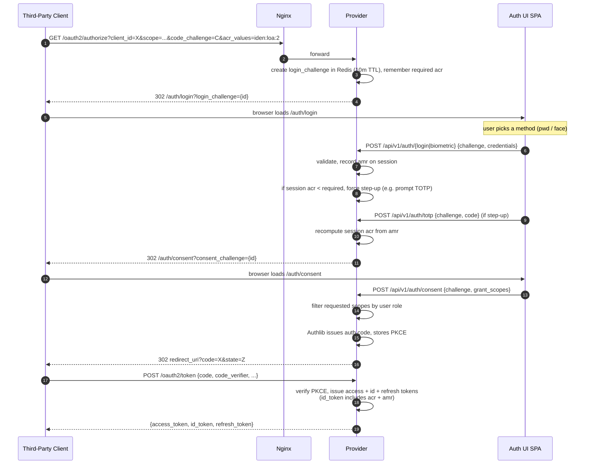

### Flow 1b: Biometric Login Branch (expands the login POST in Flow 1)

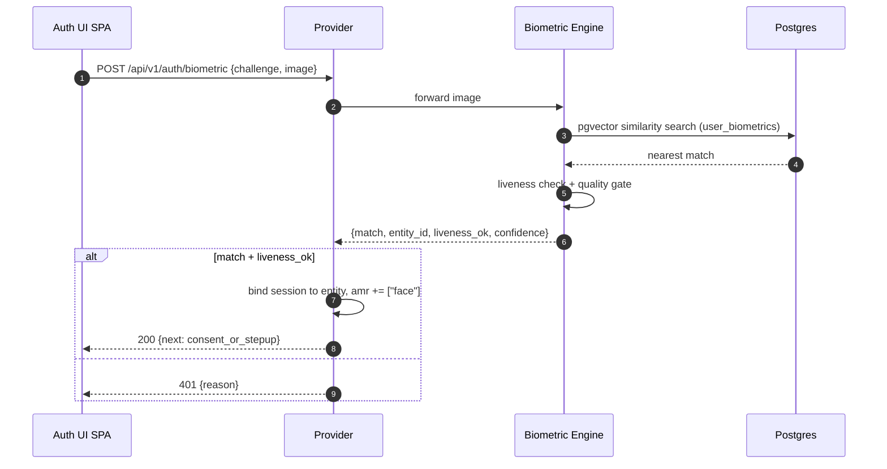

The session's `amr` now contains `face`. If the client asked for `acr_values=iden:loa:2` and face alone only satisfies `iden:loa:1`, Flow 1's step-up prompt kicks in (e.g. TOTP) before the consent challenge is minted.

### Flow 2: Dashboard SPA — Admin Action

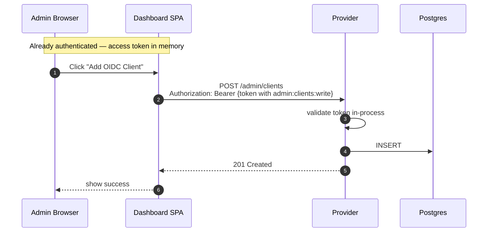

### Flow 3: Dashboard SPA — Entity Self-Service (TOTP Enrollment)

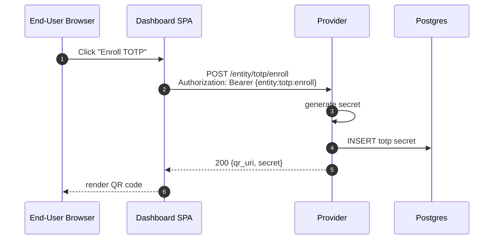

### Flow 4: Biometric Kiosk Enrollment (client_credentials)

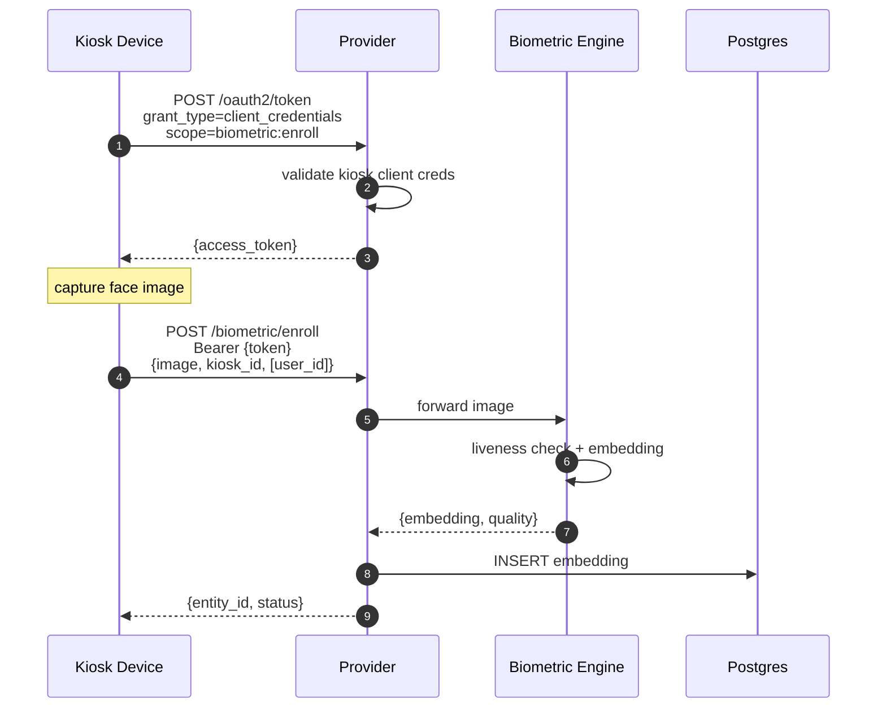

> **Further thought needed:** what data the kiosk attaches when enrolling a *new* (non-existing) user, and how the system later prompts that user to complete their profile via the Dashboard SPA.

### Flow 5: Biometric Verification (External OAuth Client)

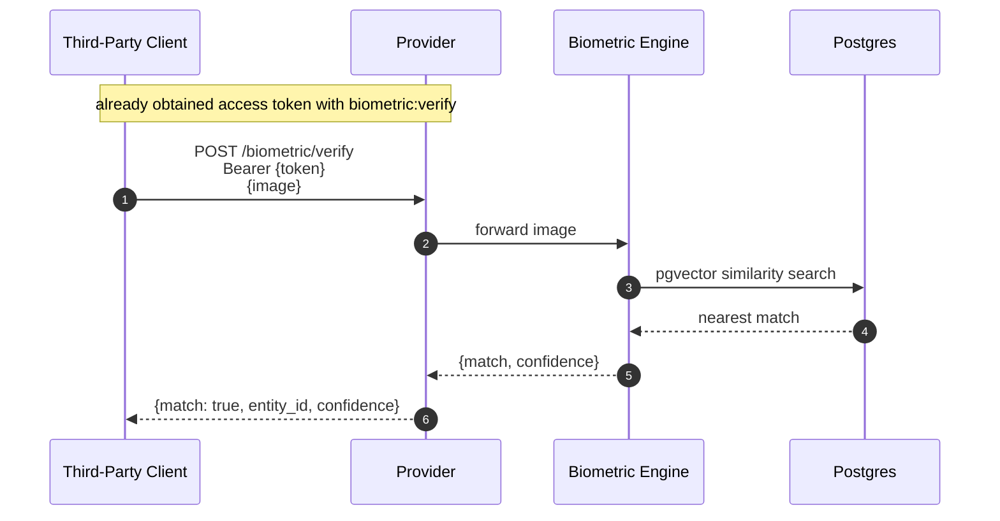

### Flow 6: Session & Challenge Lifecycle (Redis)

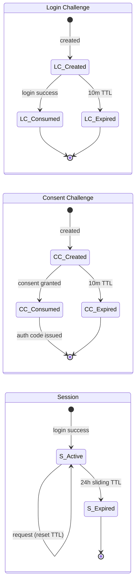

---

## Database Schema

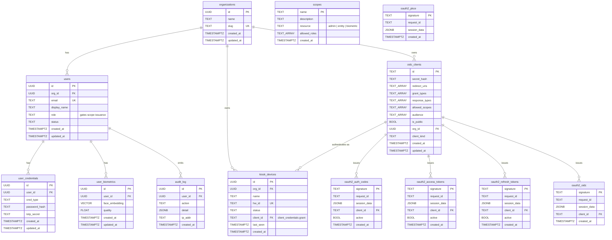

> `scopes` is read-only metadata (seeded, not user-managed). The five `oauth2_*` tables are Authlib's storage tables for the OAuth2/OIDC grant flows.

---

## Provider Internal Architecture

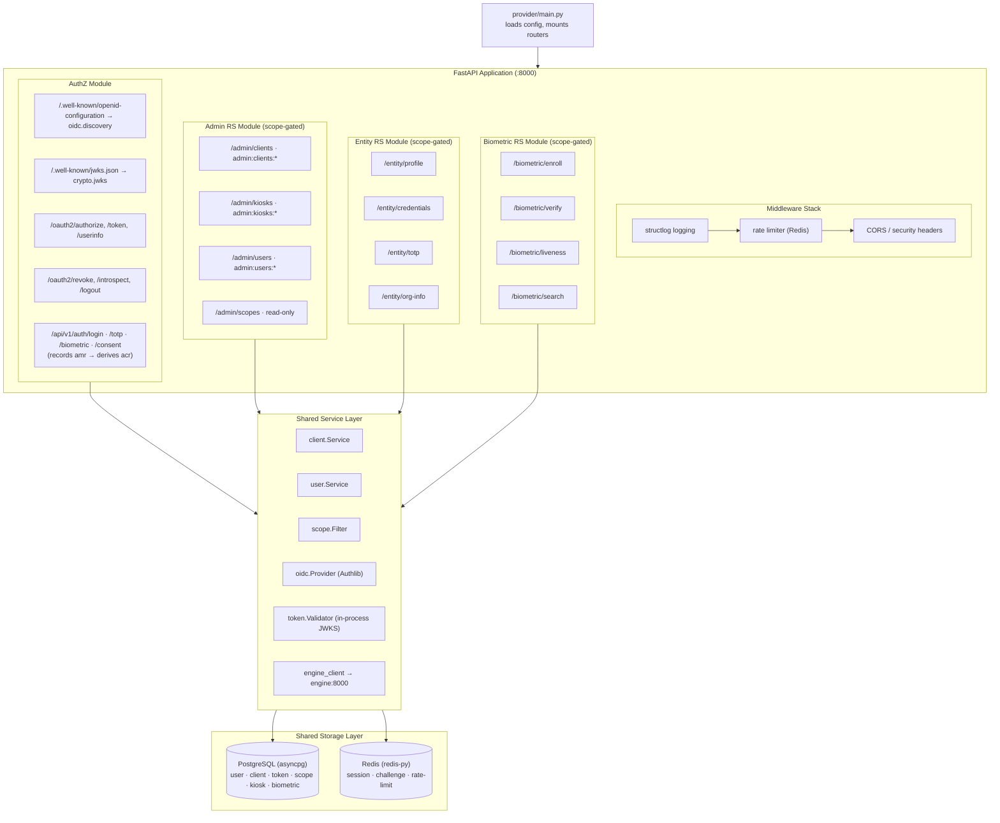

Because every module lives in the same process, resource-server routes validate access tokens **in-process** against the same key material the AuthZ module signed them with — no cross-service introspection hop.

---

## Docker Network Topology

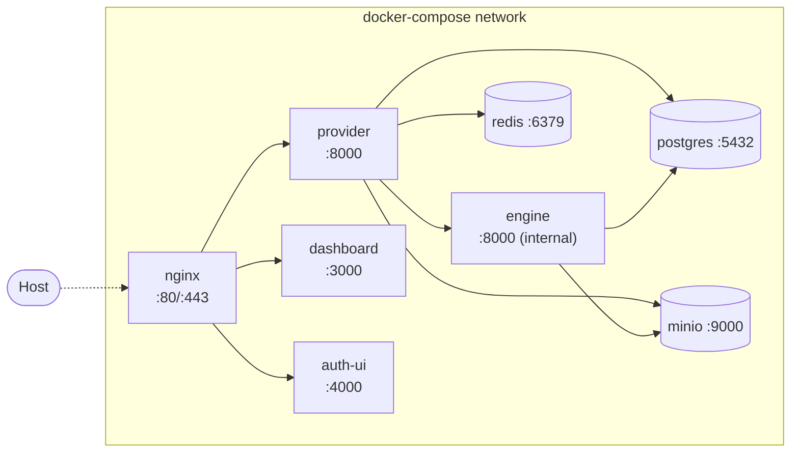

Only `nginx` is exposed to the host. The biometric engine is reachable only from within the Docker network.

---

## Project Structure

```
project-iden/
├── provider/                        # Single FastAPI app — all backend routes
│   ├── main.py                      # Mounts all module routers
│   ├── config.py
│   ├── crypto/                      # RSA key generation, JWKS
│   ├── authz/                       # AuthZ Server module
│   │   ├── oidc/                    # Authlib provider, OAuth2/OIDC handlers
│   │   ├── authn/                   # Login/consent handlers, session
│   │   └── scope/                   # Role-based scope filter
│   ├── admin/                       # Admin RS module
│   │   ├── clients.py               # /admin/clients
│   │   ├── kiosks.py                # /admin/kiosks
│   │   ├── users.py                 # /admin/users
│   │   └── scopes.py                # /admin/scopes  (read-only)
│   ├── entity/                      # Entity RS module
│   │   ├── profile.py               # /entity/profile
│   │   ├── credentials.py           # /entity/credentials
│   │   ├── totp.py                  # /entity/totp
│   │   └── org_info.py              # /entity/org-info
│   │   # NOTE: further thoughts needed on full surface area
│   ├── biometric/                   # Biometric RS module
│   │   ├── enroll.py                # /biometric/enroll
│   │   ├── verify.py                # /biometric/verify
│   │   ├── liveness.py              # /biometric/liveness
│   │   ├── search.py                # /biometric/search
│   │   └── engine_client.py         # Calls internal engine
│   ├── shared/
│   │   ├── auth/                    # In-process token validator used by all RS modules
│   │   ├── client/                  # OIDC client model, service
│   │   └── user/                    # User model, service
│   ├── store/postgres/              # user, client, token, scope, kiosk, biometric
│   ├── store/redis/                 # session, challenge
│   ├── middleware/
│   ├── migrations/
│   ├── requirements.txt
│   └── Dockerfile
│
├── engine/                          # Biometric Engine (internal only)
│   ├── app/
│   │   ├── main.py
│   │   ├── config.py
│   │   ├── middleware.py            # X-Engine-Key auth
│   │   ├── routes/                  # enroll, verify, liveness, search
│   │   └── services/                # Face detection/embedding
│   ├── requirements.txt
│   └── Dockerfile
│   # NOTE: further thoughts needed
│
├── dashboard/                       # IDEN Dashboard SPA
│   ├── src/app/
│   │   ├── (admin)/clients/
│   │   ├── (admin)/kiosks/
│   │   ├── (admin)/users/
│   │   ├── (entity)/profile/
│   │   ├── (entity)/credentials/
│   │   └── (entity)/totp/
│   ├── src/lib/oidc.ts              # OIDC client config (bootstrapped)
│   ├── package.json
│   └── Dockerfile
│
├── auth-ui/                         # IDEN Authentication SPA
│   ├── src/app/
│   │   ├── login/                   # /auth/login
│   │   └── consent/                 # /auth/consent
│   ├── package.json
│   └── Dockerfile
│
├── kiosk/                           # Biometric Kiosk firmware/app
│   └── ...
│   # NOTE: further thoughts needed
│
├── deploy/
│   ├── nginx/nginx.conf
│   └── .env.example
├── docker-compose.yml
├── .gitignore
└── README.md
```

---

## Key Design Decisions

| Decision | Choice | Rationale |
|---|---|---|
| Authorization model | Scope-only at resource servers; role-gated at token issuance | Avoids the RBAC complexity of Keycloak; resource servers stay stateless wrt identity |
| Scope management | Fixed, IDEN-defined scopes; no user-creatable scopes | Eliminates an entire class of misconfiguration and audit drift |
| OIDC library | [Authlib](https://github.com/lepture/authlib) | Most mature Python OIDC library, full spec compliance |
| Token format | Opaque access tokens, JWT ID tokens | Access tokens revocable via DB lookup; resource servers validate via introspection or short-lived JWT access tokens (TBD) |
| Service decomposition | Single `provider` process with AuthZ + 3 RS modules + 2 SPAs | Keeps ops simple — one port, one image, one deployable; modules are logical, not physical. Biometric engine is the only sidecar. |
| Token validation | In-process (no introspection hop) | Since all RS modules share the process, they validate tokens directly against the same JWKS the AuthZ module signed them with |
| Hosted login UI | Separate `auth-ui` SPA, not embedded | Decouples credential capture from any product surface; only `/authorize` knows about it |
| Assurance reporting | Standard OIDC `amr` + `acr` claims with IDEN-defined `iden:loa:{1,2,3}` levels | Relying parties can request a minimum level via `acr_values`; IDEN enforces step-up when the session falls short |
| Bootstrapped client | Dashboard SPA registered automatically on first start | Avoids chicken-and-egg of needing an OIDC client to manage OIDC clients |
| Password hashing | argon2id (time=1, mem=64MB, threads=4) | OWASP recommended, memory-hard |
| Session storage | Redis with sliding 24h TTL | Fast lookups, automatic expiry |
| Challenge pattern | Redis with 10min TTL | Ephemeral by design, prevents replay |
| Database driver | asyncpg | Native async PostgreSQL driver |
| HTTP framework | FastAPI | Async-first, OpenAPI docs, Pydantic validation |
| Kiosk auth | `client_credentials` grant against AuthZ Server | Kiosks are first-class OAuth clients; no user impersonation |
| Biometric engine | Internal-only Docker network | Face data never directly accessible from the internet |
| Vector search | pgvector | Face embedding similarity search without a separate vector DB |
| Object storage | MinIO (S3-compatible) | Face images, profile photos, and other blobs live in object storage, not Postgres — Postgres keeps only the row + the object key. S3-compatible API lets ops swap in AWS S3, R2, or GCS in production without code changes. |

---

## Quick Start

```bash
git clone https://github.com/iden-project/iden.git
cd iden
docker compose up --build

# Services available at:
#   http://localhost                     — Dashboard SPA
#   http://localhost/auth/login          — Login UI
#   http://localhost/oauth2/authorize    — OIDC authorize endpoint
#   http://localhost/.well-known/openid-configuration
```

### Verify the Setup

```bash
curl http://localhost/.well-known/openid-configuration
curl http://localhost/.well-known/jwks.json
```

---

## Development Phases

| Phase | Focus | Status |
|-------|-------|--------|
| **Phase 1** | Provider (AuthZ + Admin modules) + Auth UI + Dashboard SPA | In Progress |
| **Phase 2** | Provider: Entity module — self-service profile, credentials, TOTP enrollment | Planned |
| **Phase 3** | Provider: Biometric module + Engine — enrollment, verification, liveness | Planned |
| **Phase 4** | Biometric Kiosk Systems — device registration, client_credentials enrollment flow | Planned |
| **Phase 5** | Production — HA deployment, monitoring, audit logging, compliance | Planned |

---

## Open Design Questions

- **Entity Resource Server**: full API surface beyond profile/credentials/TOTP; how org-defined custom fields are modeled.
- **Biometric Kiosk Systems**: the new-entity enrollment handoff — how a kiosk-enrolled entity is later prompted (and authenticated) to complete their profile via the Dashboard SPA.
- **Biometric Engine**: model selection, GPU vs CPU deployment, accuracy/latency targets.

---

## License

Open Source — see [LICENSE](LICENSE) for details.
