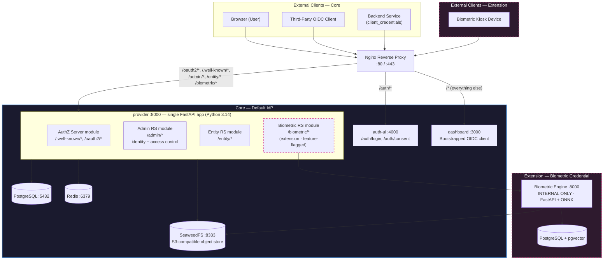
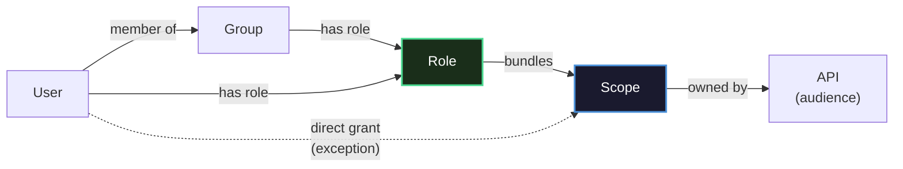
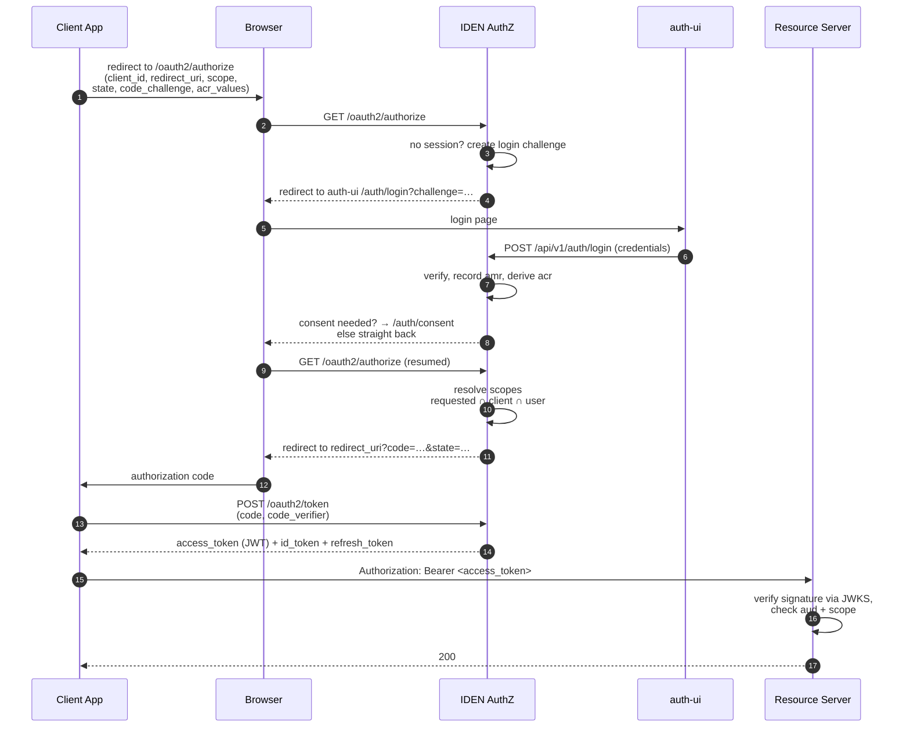
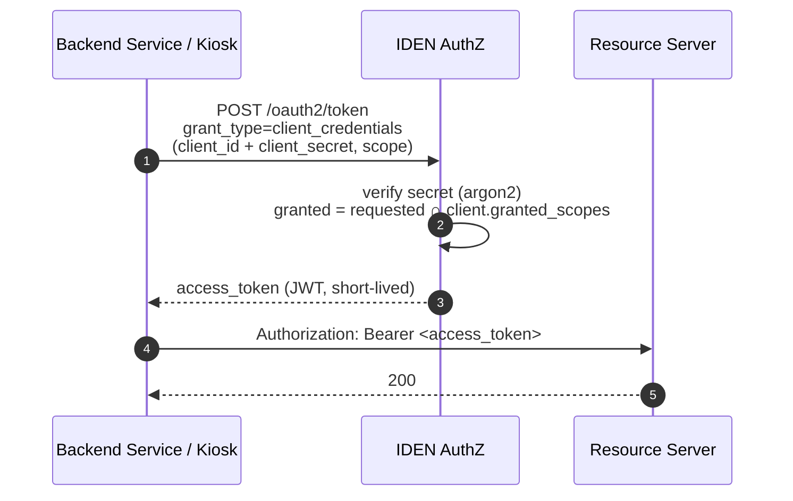
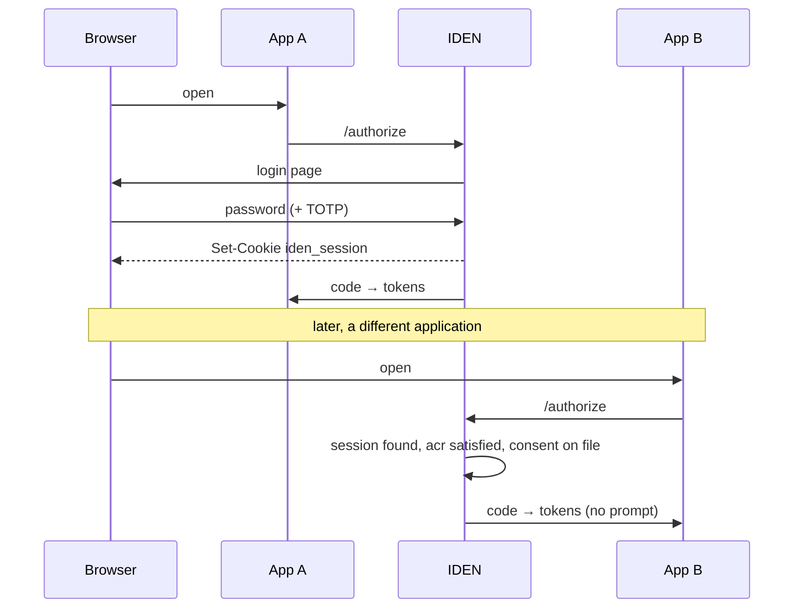
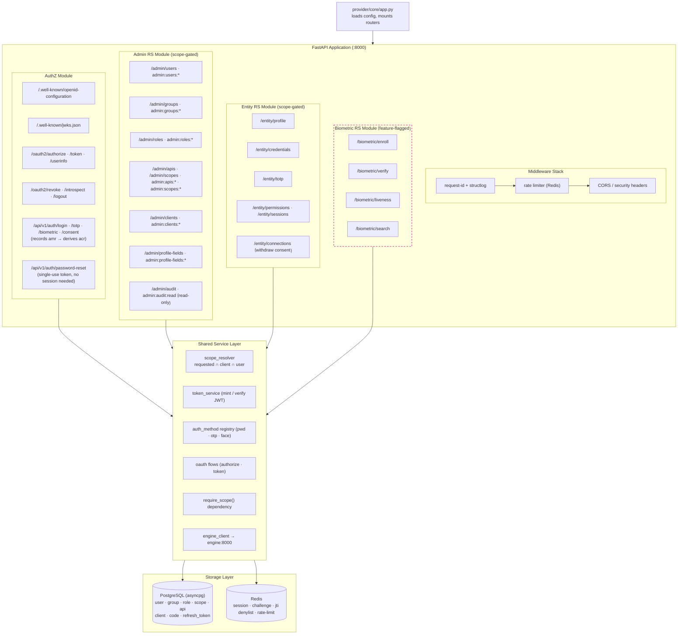
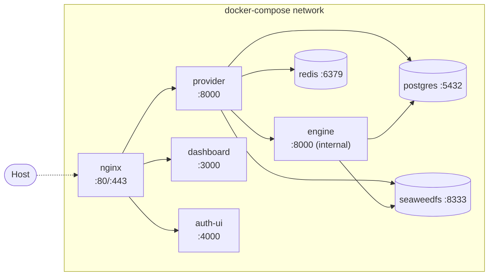

# Project IDEN — Open Source Identity & Access Control Provider

An open-source **Identity Provider (IdP)** and **Access Control** system built on the OpenID Connect
(OIDC) standard, with optional facial biometric authentication. IDEN gives a single organization a
complete, self-hosted platform for answering the two questions every backend eventually asks:

1. **Who is this?** — email/password login, TOTP-based MFA, and facial recognition, surfaced to
   applications through standard OIDC.
2. **What are they allowed to do?** — a runtime-managed permission system where administrators
   register APIs, define scopes for them, bundle those scopes into roles, and assign roles to users
   and groups.

Everything deploys via Docker Compose.

---

## Documentation

Full documentation — concepts, integration guides, reference, and operations — lives in
[`doc/`](doc/index.md) and builds as a site:

```bash
uv run --project provider mkdocs serve -a localhost:8001
```

Start with [Concepts](doc/concepts/index.md) if identity is new to you, or
[Run it locally](doc/guides/quickstart.md) to have something working in five minutes. This file
stays as the system-level overview; the server's own reference is
[`provider/README.md`](provider/README.md).

---

## Table of Contents

- [Single-Organization by Design](#single-organization-by-design)
- [System Architecture](#system-architecture)
- [Component Overview](#component-overview)
- [Identity & Access Model](#identity--access-model)
- [Supported Grants](#supported-grants)
- [Single Sign-On](#single-sign-on)
- [Tokens](#tokens)
- [Authentication Assurance (acr / amr)](#authentication-assurance-acr--amr)
- [Provider Internal Architecture](#provider-internal-architecture)
- [Docker Network Topology](#docker-network-topology)
- [Key Design Decisions](#key-design-decisions)
- [Quick Start](#quick-start)
- [Development Phases](#development-phases)
- [Future Improvements — Standards Compliance](#future-improvements--standards-compliance)
- [Open Design Questions](#open-design-questions)

---

## Single-Organization by Design

IDEN is **not** a multi-tenant identity SaaS. It is not Auth0, Okta, or Entra ID.

Those products are operated by a vendor and host many unrelated customers side by side, which forces
a tenant boundary through every table, every query, and every token. IDEN takes the opposite stance:

> **One deployment belongs to exactly one organization.** You clone the repository, deploy it on your
> own infrastructure, and every user, group, role, scope, client, and biometric template in that
> database is yours.

What follows from that:

| Consequence | Detail |
|---|---|
| **No tenant column, anywhere** | There is no `tenant_id` / `organization_id` on any model. A user simply belongs to *the* organization. This removes an entire dimension of complexity from every query and every authorization check. |
| **You own the data** | Face embeddings, password hashes, and audit trails never leave infrastructure you control. For biometric data in particular, this is the whole point — see the biometric extension. |
| **Admins are your staff, not a vendor's** | The `admin:*` scopes grant real, unrestricted control over the deployment. There is no higher authority above them, and no support ticket needed to change anything. |
| **Groups model your org chart** | Departments, teams, cohorts — whatever structure you have — are modelled as groups, not as tenants. Groups share one user pool and one permission namespace. |
| **Federation is out of scope (for now)** | IDEN is the source of truth for identity, not a broker in front of other IdPs. Logging in with Google or a corporate SAML IdP is not part of the current design. |

If you need to serve two organizations that must not see each other's data, run two deployments.

---

## System Architecture


```mermaid
flowchart TB
  subgraph External["External Clients — Core"]
    Browser["Browser (User)"]
    ThirdParty["Third-Party OIDC Client"]
    Backend["Backend Service<br/>(client_credentials)"]
  end

  subgraph ExternalExt["External Clients — Extension"]
    Kiosk["Biometric Kiosk Device"]
  end

  Nginx["Nginx Reverse Proxy<br/>:80 / :443"]

  Browser --> Nginx
  ThirdParty --> Nginx
  Backend --> Nginx
  Kiosk --> Nginx

  subgraph Core["Core — Default IdP"]
    direction TB

    subgraph Provider["provider :8000 — single FastAPI app (Python 3.14)"]
      direction TB
      AuthZ["AuthZ Server module<br/>/.well-known/*, /oauth2/*"]
      Admin["Admin RS module<br/>/admin/*<br/>identity + access control"]
      Entity["Entity RS module<br/>/entity/*"]
      Biometric["Biometric RS module<br/>/biometric/*<br/>⟮extension · feature-flagged⟯"]
    end

    AuthUI["auth-ui :4000<br/>/auth/login, /auth/consent"]
    Dashboard["dashboard :3000<br/>Bootstrapped OIDC client"]

    Postgres[("PostgreSQL :5432")]
    Redis[("Redis :6379")]
    Blobs[("SeaweedFS :8333<br/>S3-compatible object store")]
  end

  subgraph Extension["Extension — Biometric Credential"]
    direction TB
    Engine["Biometric Engine :8000<br/>INTERNAL ONLY · FastAPI + ONNX"]
    PgVector[("PostgreSQL + pgvector")]
  end

  Nginx -->|"/oauth2/*, /.well-known/*,<br/>/admin/*, /entity/*, /biometric/*"| Provider
  Nginx -->|"/auth/*"| AuthUI
  Nginx -->|"/* (everything else)"| Dashboard

  Biometric --> Engine
  Engine --> PgVector
  Engine --> Blobs

  Provider --> Postgres
  Provider --> Redis
  Provider --> Blobs

  style Core fill:#1a1a2e,stroke:#4a90d9,stroke-width:2px,color:#ffffff
  style Extension fill:#2e1a2e,stroke:#d94a90,stroke-width:2px,color:#ffffff,stroke-dasharray: 5 5
  style ExternalExt fill:#2e1a2e,stroke:#d94a90,stroke-width:2px,color:#ffffff,stroke-dasharray: 5 5
  style Biometric stroke:#d94a90,stroke-width:2px,stroke-dasharray: 5 5
```

---

## Component Overview

| Component | Tech Stack | Port | Purpose |
|-----------|-----------|------|---------|
| **provider** | Python 3.14, FastAPI, SQLAlchemy, asyncpg | 8000 | Single FastAPI app hosting four logical modules: AuthZ Server (`/oauth2/*`, `/.well-known/*`), Admin RS (`/admin/*`), Entity RS (`/entity/*`), Biometric RS (`/biometric/*`) |
| **engine** | Python 3.14, FastAPI, InsightFace, ONNX | 8000 | Internal biometric engine — face detection, embedding, liveness (no external access) |
| **dashboard** | React 19, TypeScript, Vite, Tailwind CSS, TanStack Query | 3000 | Single-page app for both admin and end-user activities (bootstrapped OIDC client). Navigation renders from the token's scopes, so one build serves administrators and ordinary users. |
| **auth-ui** | React 19, TypeScript, Vite, Tailwind CSS | 4000 | Login + consent pages — supports password, TOTP, and **biometric (face)** login paths. Hosted UI invoked by `/authorize`. |
| **kiosk** | Hardware + Next.js / native | n/a | Biometric kiosk device — uses `client_credentials` to call the Biometric RS |
| **postgres** | PostgreSQL 18 + pgvector | 5432 | Users, groups, roles, scopes, APIs, clients, tokens, embeddings |
| **redis** | Redis 8 | 6379 | Sessions, login/consent challenges, token denylist, rate limits |
| **seaweedfs** | SeaweedFS (S3-compatible) | 8333 | Blob storage — profile photos, and enrollment/verification images once the biometric module lands. Keeps large binaries out of Postgres. Any S3 API answers: MinIO, Garage, or AWS S3. |
| **nginx** | Nginx Alpine | 80/443 | Reverse proxy, TLS termination, path-based routing |

---

## Identity & Access Model

This is the heart of IDEN and the part that changed most from the original design. Earlier drafts
treated scopes as a fixed list baked into the source code. They are now **first-class data that
administrators create and manage at runtime**, which is what turns IDEN from an identity provider
into an identity *and access control* provider.

### The five nouns

| Noun | What it is | Who creates it |
|---|---|---|
| **API** (resource server) | A backend that trusts IDEN. Has a name and an **audience** URI (e.g. `https://api.example.org/attendance`). Every token minted for it carries that audience. | Admin |
| **Scope** | A single permission, owned by exactly one API. A string like `attendance:records:read` plus a human description. | Admin |
| **Role** | A named bundle of scopes — a job function such as `attendance-officer`. Roles are **global**: one role may bundle scopes from several APIs. | Admin |
| **Group** | A set of users — a department, team, or cohort. Groups hold roles. Membership is flat; groups do not nest. | Admin |
| **User** | A person. Holds roles directly, inherits roles from every group they belong to, and may hold individual scope grants for one-off exceptions. | Admin (or kiosk enrollment) |


```mermaid
flowchart LR
  User["User"]
  Group["Group"]
  Role["Role"]
  Scope["Scope"]
  Api["API<br/>(audience)"]

  User -->|"member of"| Group
  Group -->|"has role"| Role
  User -->|"has role"| Role
  Role -->|"bundles"| Scope
  User -.->|"direct grant<br/>(exception)"| Scope
  Scope -->|"owned by"| Api

  style Role fill:#1a2e1a,stroke:#4ad990,stroke-width:2px,color:#ffffff
  style Scope fill:#1a1a2e,stroke:#4a90d9,stroke-width:2px,color:#ffffff
```

### Why scopes belong to an API, not to a client app

A tempting shortcut is to hang scopes off the OAuth client that requests them. That falls apart the
moment two apps talk to the same backend: the dashboard SPA and a kiosk both call the attendance
service, and you would end up defining `attendance:records:read` twice with no single answer to
"which permissions does the attendance service actually define?"

Anchoring scopes to the **API** keeps two concerns separate:

- The API **defines** what permissions exist and supplies the `aud` value tokens are minted for.
- A client **requests** a subset of them, and is limited to the subset an admin allowed it.

### Effective scopes

A user's **effective scopes** are the union of three sources:

```text
effective_user_scopes =
      scopes granted directly to the user          (exceptions)
    ∪ scopes of every role assigned to the user    (direct roles)
    ∪ scopes of every role held by any group       (inherited roles)
      the user belongs to
```

### Scope resolution at token issuance

The set of scopes that lands in an access token is an intersection, computed fresh on every issuance:

**Authorization code flow** (a human is present):

```text
granted = requested ∩ client.allowed_scopes ∩ effective_user_scopes
```

**Client credentials flow** (no human — the client *is* the identity):

```text
granted = requested ∩ client.granted_scopes
```

Two properties worth internalising:

- **Pruning is silent, not an error.** Asking for more than you are entitled to yields a smaller
  token, not a failed request. This is what lets the dashboard SPA request a broad scope set at
  `/authorize` and still work correctly for a non-admin user — they simply receive a narrower token.
- **Permissions are evaluated at issuance, never at the resource server.** Revoking a role takes
  effect when the next access token is minted, which is why access tokens are short-lived and
  refresh tokens exist. Resource servers stay completely stateless with respect to identity: they
  validate the signature, check `aud`, and read `scope`. They never look up a user, a role, or a
  group.

### System scopes are protected

IDEN seeds its own APIs (`admin`, `entity`, and optionally `biometric`) along with their scopes and a
bootstrap `administrator` role. Everything seeded is flagged `is_system` and **cannot be renamed or
deleted** through the admin API. Admin-created APIs, scopes, roles, and groups carry no such flag and
are fully mutable.

Without that guard, an administrator could delete `admin:roles:write` and permanently lock the
organization out of its own deployment.

### The admin surface this creates

| Resource | Endpoints |
|---|---|
| APIs | `GET/POST /admin/apis`, `GET/PATCH/DELETE /admin/apis/{id}` |
| Scopes | `GET/POST /admin/apis/{id}/scopes`, `GET/PATCH/DELETE /admin/scopes/{id}` |
| Roles | `GET/POST /admin/roles`, `GET/PATCH/DELETE /admin/roles/{id}`, `PUT /admin/roles/{id}/scopes` |
| Groups | `GET/POST /admin/groups`, `GET/PATCH/DELETE /admin/groups/{id}`, `PUT /admin/groups/{id}/roles`, `POST/DELETE /admin/groups/{id}/members` |
| Users | `GET/POST /admin/users`, `GET/PATCH/DELETE /admin/users/{id}`, `PUT /admin/users/{id}/roles`, `GET /admin/users/{id}/effective-scopes` |
| Clients | `GET/POST /admin/clients`, `GET/PATCH/DELETE /admin/clients/{id}`, `POST /admin/clients/{id}/rotate-secret` |

`GET /admin/users/{id}/effective-scopes` is deliberately part of the surface: when someone asks *why
can this person do that?*, the answer should be one request away, with each scope annotated by the
role or group it came from.

---

## Supported Grants

IDEN implements the two grant types that cover essentially all modern use cases, and deliberately
**omits the rest**. Implicit and resource-owner-password grants are excluded because they are
discouraged by [OAuth 2.1](https://oauth.net/2.1/); device code and refresh-only flows are out of
scope for now.

### 1. Authorization Code + PKCE — for anything with a user

Used by the dashboard SPA, third-party web apps, and mobile apps. **PKCE with `S256` is mandatory for
every client**, public or confidential — there is no non-PKCE path.


```mermaid
sequenceDiagram
  autonumber
  participant App as Client App
  participant B as Browser
  participant AZ as IDEN AuthZ
  participant UI as auth-ui
  participant RS as Resource Server

  App->>B: redirect to /oauth2/authorize<br/>(client_id, redirect_uri, scope,<br/>state, code_challenge, acr_values)
  B->>AZ: GET /oauth2/authorize
  AZ->>AZ: no session? create login challenge
  AZ-->>B: redirect to auth-ui /auth/login?challenge=…
  B->>UI: login page
  UI->>AZ: POST /api/v1/auth/login (credentials)
  AZ->>AZ: verify, record amr, derive acr
  AZ-->>B: consent needed? → /auth/consent<br/>else straight back
  B->>AZ: GET /oauth2/authorize (resumed)
  AZ->>AZ: resolve scopes<br/>requested ∩ client ∩ user
  AZ-->>B: redirect to redirect_uri?code=…&state=…
  B->>App: authorization code
  App->>AZ: POST /oauth2/token<br/>(code, code_verifier)
  AZ-->>App: access_token (JWT) + id_token + refresh_token
  App->>RS: Authorization: Bearer <access_token>
  RS->>RS: verify signature via JWKS,<br/>check aud + scope
  RS-->>App: 200
```

### 2. Client Credentials — for machines

Used by kiosk devices, cron jobs, and service-to-service calls. There is no user, so the token has no
person behind its `sub`, carries no `id_token`, and gets no refresh token — the client just asks
again.


```mermaid
sequenceDiagram
  autonumber
  participant Svc as Backend Service / Kiosk
  participant AZ as IDEN AuthZ
  participant RS as Resource Server

  Svc->>AZ: POST /oauth2/token<br/>grant_type=client_credentials<br/>(client_id + client_secret, scope)
  AZ->>AZ: verify secret (argon2)<br/>granted = requested ∩ client.granted_scopes
  AZ-->>Svc: access_token (JWT, short-lived)
  Svc->>RS: Authorization: Bearer <access_token>
  RS-->>Svc: 200
```

Only **confidential** clients may use this grant; a public client has no secret to prove with.

---

## Single Sign-On

SSO is not a separate feature bolted onto an identity provider — it is what one *is*. In IDEN it is
the browser session: a user signs into the first application through `/oauth2/authorize` and receives
the `iden_session` cookie; when the second application redirects to the same endpoint, the session is
already there, so a code is returned without another password prompt. Nothing in the client
applications coordinates this, and they never see each other.


```mermaid
sequenceDiagram
    participant U as Browser
    participant A as App A
    participant P as IDEN
    participant B as App B

    U->>A: open
    A->>P: /authorize
    P->>U: login page
    U->>P: password (+ TOTP)
    P-->>U: Set-Cookie iden_session
    P->>A: code → tokens

    Note over U,B: later, a different application

    U->>B: open
    B->>P: /authorize
    P->>P: session found, acr satisfied, consent on file
    P->>B: code → tokens (no prompt)
```

Two things make this more than a shared cookie, and both landed in **Phase 3**:

- **Control.** `prompt=none` lets a browser application ask "is this person still signed in?" without
  a visible redirect — the mechanism behind silent token renewal. `max_age` lets a client insist on a
  recent authentication for a sensitive screen, which is the same machinery as `acr_values` measured
  in seconds instead of methods.
- **Single sign-*out*.** Ending the IDEN session has to end the applications' sessions too, or
  "sign out" means "sign out of one tab". IDEN records which clients a session issued codes to and,
  on logout, revokes that session's refresh tokens and delivers a signed **logout token** to each
  client's registered back-channel URI (OIDC Back-Channel Logout 1.0). Sign-out is the half of SSO
  that is easy to skip and the half users notice.

Federation — *sign in with Google, or with the campus IdP* — is a different feature: it would make
IDEN a relying party to someone else's provider rather than the provider itself. It is not planned;
see [Open Design Questions](#open-design-questions).

---

## Tokens

| Token | Format | Lifetime | Storage |
|---|---|---|---|
| **Access token** | Signed JWT (`RS256`) | ~10 minutes | Stateless — nothing stored. A `jti` denylist in Redis handles early revocation. |
| **ID token** | Signed JWT (`RS256`) | ~10 minutes | Stateless. Identity claims only; never sent to APIs. |
| **Refresh token** | Opaque random string | ~30 days, sliding | Hashed in Postgres; **rotated on every use**, and reuse of an already-used token revokes the whole family. |
| **Authorization code** | Opaque random string | 60 seconds, single use | Postgres, bound to `client_id` + `code_challenge`. |

A representative access token payload:

```json
{
  "iss": "https://iden.example.org",
  "sub": "9f1c…",
  "aud": "https://api.example.org/attendance",
  "client_id": "dashboard",
  "scope": "attendance:records:read entity:profile:read",
  "acr": "iden:loa:2",
  "amr": ["pwd", "otp"],
  "jti": "01J…",
  "iat": 1750000000,
  "exp": 1750000600
}
```

**Why JWT access tokens rather than opaque ones?** IDEN is designed to sit in front of *various*
resource servers, some of which are not part of this repository and may not even be written in
Python. A JWT lets any of them validate a request offline against the published JWKS — no network
call back to IDEN on every request, no shared cache to operate. The cost is that revocation is not
instantaneous; short lifetimes plus the `jti` denylist bound the exposure.

Public keys are served at `/.well-known/jwks.json` with a `kid` per key, so keys can be rotated
without downtime: publish the new key, sign with it, retire the old one once outstanding tokens have
expired.

---

## Authentication Assurance (acr / amr)

IDEN supports multiple authentication methods — password, TOTP, and **facial biometric** — and
reports them to relying parties using the two standard OIDC id-token claims:

- **`amr`** (Authentication Methods References, [RFC 8176](https://datatracker.ietf.org/doc/html/rfc8176)) — an array naming the methods actually used. IDEN emits values from a fixed set:

  | `amr` value | Meaning |
  |---|---|
  | `pwd` | Password |
  | `otp` | TOTP (RFC 6238) |
  | `face` | Facial biometric match (liveness-verified) |
  | `mfa` | Present whenever two or more of the above were used |

- **`acr`** (Authentication Context Class Reference) — a single string naming the assurance *level*. IDEN defines its own taxonomy:

  | `acr` value | Requires |
  |---|---|
  | `iden:loa:1` | Any single factor — `pwd`, or `face` with liveness |
  | `iden:loa:2` | Two factors — e.g. `pwd + otp`, `pwd + face`, `face + otp` |
  | `iden:loa:3` | Strong — `face` (liveness-verified) plus one additional factor |

### How it plays out in the protocol

- Clients may request a minimum level at `/authorize` using `acr_values=iden:loa:2`.
- If the user's current session doesn't meet the requested level, the AuthZ module forces a step-up
  login (e.g. prompts for TOTP after a password-only login) before issuing the code.
- The issued id_token contains both claims, e.g.:
  ```json
  { "sub": "...", "acr": "iden:loa:2", "amr": ["pwd", "face"], ... }
  ```
- Discovery (`/.well-known/openid-configuration`) advertises `acr_values_supported` and lists `acr`
  and `amr` under `claims_supported`.

### How methods map to the login UI

The Auth UI offers a method picker on the login page. Each choice resolves to a distinct AuthZ
endpoint that appends its method to the session's `amr` list:

| Method | Endpoint | Session gets |
|---|---|---|
| Password | `POST /api/v1/auth/login` | `amr += ["pwd"]` |
| TOTP (step-up) | `POST /api/v1/auth/totp` | `amr += ["otp"]` |
| Biometric (face) | `POST /api/v1/auth/biometric` | `amr += ["face"]` (only if the engine reports a liveness-verified match) |

`acr` is never stored — it is **derived from `amr` at token-issuance time** using the table above.
Keeping one source of truth means a step-up midway through a session automatically upgrades the next
token, with no state to keep in sync.

Each method is registered in a small **auth-method registry**, which is the seam that lets the
biometric module add `face` without the AuthZ core knowing anything about faces.

---

## Provider Internal Architecture


```mermaid
flowchart TB
  Entry["provider/core/app.py<br/>loads config, mounts routers"]

  subgraph App["FastAPI Application (:8000)"]
    direction TB

    subgraph Middleware["Middleware Stack"]
      MW1["request-id + structlog"] --> MW2["rate limiter (Redis)"] --> MW3["CORS / security headers"]
    end

    subgraph AuthZMod["AuthZ Module"]
      AZ1["/.well-known/openid-configuration"]
      AZ2["/.well-known/jwks.json"]
      AZ3["/oauth2/authorize · /token · /userinfo"]
      AZ4["/oauth2/revoke · /introspect · /logout"]
      AZ5["/api/v1/auth/login · /totp · /biometric · /consent<br/>(records amr → derives acr)"]
      AZ6["/api/v1/auth/password-reset<br/>(single-use token, no session needed)"]
    end

    subgraph AdminMod["Admin RS Module (scope-gated)"]
      AD1["/admin/users · admin:users:*"]
      AD2["/admin/groups · admin:groups:*"]
      AD3["/admin/roles · admin:roles:*"]
      AD4["/admin/apis · /admin/scopes · admin:apis:* · admin:scopes:*"]
      AD5["/admin/clients · admin:clients:*"]
      AD6["/admin/profile-fields · admin:profile-fields:*"]
      AD7["/admin/audit · admin:audit:read ⟮read-only⟯"]
    end

    subgraph EntityMod["Entity RS Module (scope-gated)"]
      EN1["/entity/profile"]
      EN2["/entity/credentials"]
      EN3["/entity/totp"]
      EN4["/entity/permissions · /entity/sessions"]
      EN5["/entity/connections ⟮withdraw consent⟯"]
    end

    subgraph BioMod["Biometric RS Module ⟮feature-flagged⟯"]
      BI1["/biometric/enroll"]
      BI2["/biometric/verify"]
      BI3["/biometric/liveness"]
      BI4["/biometric/search"]
    end
  end

  subgraph Shared["Shared Service Layer"]
    SV1["scope_resolver<br/>requested ∩ client ∩ user"]
    SV2["token_service (mint / verify JWT)"]
    SV3["auth_method registry (pwd · otp · face)"]
    SV4["oauth flows (authorize · token)"]
    SV5["require_scope() dependency"]
    SV6["engine_client → engine:8000"]
  end

  subgraph Storage["Storage Layer"]
    PG[("PostgreSQL (asyncpg)<br/>user · group · role · scope · api<br/>client · code · refresh_token")]
    RD[("Redis<br/>session · challenge · jti denylist · rate-limit")]
  end

  Entry --> App
  AuthZMod --> Shared
  AdminMod --> Shared
  EntityMod --> Shared
  BioMod --> Shared
  Shared --> PG
  Shared --> RD

  style BioMod stroke:#d94a90,stroke-width:2px,stroke-dasharray: 5 5
```

Because every module lives in the same process, the resource-server modules validate access tokens
**in-process** against the same key material the AuthZ module signed them with — no introspection
hop. External resource servers get the same guarantee via JWKS.

---

## Docker Network Topology


```mermaid
flowchart LR
  Host(["Host"]) -.-> Nginx

  subgraph Net["docker-compose network"]
    direction LR
    Nginx["nginx<br/>:80/:443"]
    Provider["provider<br/>:8000"]
    Dashboard["dashboard<br/>:3000"]
    AuthUI["auth-ui<br/>:4000"]
    Engine["engine<br/>:8000 (internal)"]
    PG[("postgres :5432")]
    RD[("redis :6379")]
    MN[("seaweedfs :8333")]

    Nginx --> Provider
    Nginx --> Dashboard
    Nginx --> AuthUI
    Provider --> Engine
    Provider --> PG
    Provider --> RD
    Provider --> MN
    Engine --> PG
    Engine --> MN
  end
```

Only `nginx` is exposed to the host. The biometric engine is reachable only from within the Docker
network.

---

## Key Design Decisions

| Decision | Choice | Rationale |
|---|---|---|
| Deployment model | Single-organization, self-hosted; no tenant concept | The org owns its own data and its own admins; removes a whole dimension of complexity from every model and query |
| Authorization model | Scope-only at resource servers; user → role → scope resolved at token issuance | Resource servers stay stateless wrt identity — they read `aud` and `scope`, never look up a user |
| Scope management | **Admin-managed at runtime**, owned by a registered API | This is what makes IDEN an access-control provider and not just an IdP; system scopes stay immutable to prevent lockout |
| Role shape | Global named bundles of scopes, assignable to users *and* groups | Matches how organizations actually talk about permissions ("attendance officer"), and one role can span several APIs |
| Group shape | Flat, non-nesting | Nested groups make effective-permission resolution recursive and hard to explain; flat groups cover the real cases |
| Supported grants | `authorization_code` + PKCE, `client_credentials` only | The two flows that cover humans and machines; implicit and password grants are discouraged by OAuth 2.1 |
| PKCE | Mandatory (`S256`) for all clients, public and confidential | One code path, no downgrade attack surface |
| Token format | JWT access tokens + JWKS; opaque, rotating refresh tokens | External resource servers validate offline; refresh rotation with reuse detection limits theft impact |
| Revocation | Short access-token TTL + Redis `jti` denylist | The pragmatic middle ground between stateless JWTs and per-request introspection |
| OIDC implementation | Hand-written on [PyJWT](https://github.com/jpadilla/pyjwt) | Authlib's authorization-server integrations target Flask and Django; its Starlette module is a *client*, not a provider. Wrapping its framework-agnostic core would mean maintaining an adapter that hides the protocol. With only two grants to support, explicit code is smaller and readable end to end. |
| Consent | Per-client `skip_consent` flag (default off), persisted grants | First-party apps don't nag your own staff; third-party clients still get a real OIDC consent flow |
| Service decomposition | One `provider` process with AuthZ + 3 RS modules | One port, one image, one deployable; modules are logical, not physical. The biometric engine is the only sidecar. |
| Biometric extension | In-repo module behind `IDEN_BIOMETRIC_ENABLED` | IDEN runs and demos with zero biometric infrastructure, yet the module ships and integrates through the auth-method registry |
| Hosted login UI | Separate `auth-ui` SPA, not embedded | Decouples credential capture from any product surface; only `/authorize` knows about it |
| Assurance reporting | Standard `amr` + `acr` with IDEN-defined `iden:loa:{1,2,3}` | Relying parties request a minimum via `acr_values`; IDEN enforces step-up when the session falls short |
| Bootstrapped client | Dashboard SPA registered by the seed script on first start | Avoids the chicken-and-egg of needing an OIDC client to manage OIDC clients |
| Password hashing | argon2id (time=1, mem=64MB, threads=4) | OWASP recommended, memory-hard |
| Single sign-on | The browser session cookie; no extra protocol | SSO is what an OIDC provider *is* — a shared session plus per-client consent, not a feature layered on top |
| Single sign-out | Back-channel logout tokens to each client the session touched | Front-channel logout depends on hidden iframes and third-party cookies, which browsers are removing; a server-to-server POST works regardless |
| Federation | Out of scope — IDEN is the provider, not a broker | Linking an upstream identity to a local account by email is the standard shortcut and a standard account takeover; a deliberate feature, not a default |
| Session storage | Redis with sliding 24h TTL | Fast lookups, automatic expiry |
| Challenge pattern | Redis with 10min TTL | Ephemeral by design, prevents replay |
| Database driver | asyncpg + SQLAlchemy 2.0 async ORM | Native async PostgreSQL driver; one source of truth for models |
| HTTP framework | FastAPI | Async-first, OpenAPI docs, Pydantic validation |
| Kiosk auth | `client_credentials` against the AuthZ Server | Kiosks are first-class OAuth clients; no user impersonation |
| Biometric engine | Internal-only Docker network | Face data is never directly reachable from the internet |
| Vector search | pgvector | Face embedding similarity search without a separate vector DB |
| Object storage | Anything speaking S3 | Blobs live in object storage, Postgres keeps the row + object key. The provider targets the API, not an implementation, so the compose default (SeaweedFS, Apache-2.0) swaps for MinIO, Garage, S3, R2, or GCS by changing two environment variables. |

---

## Quick Start

```bash
git clone https://github.com/yephonekyaw/iden.git
cd iden

# IDEN signs tokens with a key you own, and refuses to start without one.
docker compose -f deploy/docker-compose.yml build provider
docker run --rm -v "$PWD/provider/keys:/keys" -e IDEN_SIGNING_KEY_DIR=/keys \
  --entrypoint python iden-dev-provider:latest -m scripts.gen_keys

docker compose -f deploy/docker-compose.yml up -d --build

# Permissions, the two starting roles, the bootstrap administrator, two clients.
docker compose -f deploy/docker-compose.yml exec provider python -m scripts.seed
```

```text
#   http://localhost:3000/console/              — Dashboard SPA
#   http://localhost:4000/auth/login            — Login UI
#   http://localhost:8000/oauth2/authorize      — OIDC authorize endpoint
#   http://localhost:8000/.well-known/openid-configuration
```

Each service publishes its own port on loopback. In a real deployment all three sit on **one
origin** — the provider at the root, the sign-in page under `/auth`, the dashboard under `/console`
— which is what `deploy/nginx/iden.conf.example` sets up. To put that origin on the internet with
no inbound port at all:

```bash
cp deploy/.env.example deploy/.env          # hostname, tunnel token
cp deploy/nginx/iden.conf.example deploy/nginx/iden.conf

docker compose -f deploy/docker-compose.yml \
               -f deploy/docker-compose.tunnel.yml up -d --build
```

See [Behind a Cloudflare Tunnel](doc/operations/cloudflare-tunnel.md).

### Verify the Setup

```bash
curl http://localhost:8000/.well-known/openid-configuration
curl http://localhost:8000/.well-known/jwks.json
```

Then open the dashboard at <http://localhost:3000/console/> and sign in.

The seed prints the bootstrap administrator's password **once** — it is hashed on the way into the
database and cannot be recovered. Change it immediately after signing in.

For a full walkthrough, including a check on every part of the system before anyone else is let in,
see [Install IDEN for your organization](doc/guides/install.md).

For backend development without Docker, see [provider/README.md](provider/README.md) and the phased
build plan in [provider/PLAN.md](provider/PLAN.md).

---

## Development Phases

| Phase | Focus | Status |
|-------|-------|--------|
| **Phase 0** | Provider foundation — config, database, models, security, seed | Done |
| **Phase 1** | Provider AuthZ core — discovery, JWKS, authorize + PKCE, token, userinfo, login/consent | Done |
| **Phase 2** | Provider Admin RS — users, groups, roles, APIs, scopes, clients (the access-control surface) | Done |
| **Phase 3** | Provider SSO — `prompt`, `max_age`, `sid`, back-channel logout (single sign-*out*) | Done |
| **Phase 4** | Provider Entity RS — self-service profile, org-defined fields, credentials, TOTP, recovery | Done |
| **Phase 5** | Biometric module + Engine — enrollment, verification, liveness (feature-flagged) | Next |
| **Phase 6** | Hardening — tests, Docker Compose, TLS (migrations, the audit log and rate limiting landed early) | Planned |
| **Phase 7** | Frontends — auth-ui and dashboard SPAs | In progress |
| **Phase 8** | Kiosk systems — device registration, `client_credentials` enrollment flow | Planned |

Phases 0–6 are broken down file-by-file in [provider/PLAN.md](provider/PLAN.md), and Phase 7 in
[web/PLAN.md](web/PLAN.md). Tests ship with the
phase that introduces the code — `uv run pytest` from `provider/` runs the suite.

Issues found in review are tracked in
[provider/PLAN.md — Known issues](provider/PLAN.md#known-issues); six are fixed, the rest are
scheduled. **IDEN is not yet ready for a deployment reachable by anyone but its developers** — there
are no rate limits at the reverse proxy yet, and IDEN's own limits assume one in front of it.

---

## Future Improvements — Standards Compliance

IDEN implements OIDC and OAuth 2.0 by hand rather than through a framework, which is what makes the
protocol readable end to end — and also what makes it possible to be *almost* right in places nobody
notices until an unfamiliar client library shows up. This section is the running list of where the
implementation departs from the specifications it claims, so the departures are choices rather than
discoveries.

Nothing here blocks the current deployment model, where every client is one this repository ships.
They start to matter the moment a third-party OIDC library talks to IDEN.

### Tier 1 — Conformance gaps — **closed**

Each was small, specific, and observable by pointing a conforming client at the provider. All eight
are fixed and pinned by `tests/test_conformance.py`, which names the clause each one enforces.

| | Specification | What was wrong | What it is now |
|---|---|---|---|
| **C-1** | RFC 9068 Section 2.1 | Access tokens carried no `typ` header and nothing checked one, so a token was identified only by the claims it happened to have. `/oauth2/userinfo` and `/oauth2/introspect` read `claims["jti"]` unconditionally — an ID token has none, so presenting one there raised `KeyError` and answered **500** where 401 belongs. | Access tokens are signed `at+jwt`, logout tokens `logout+jwt`, and every consumer states which it accepts. `id_token_hint` still takes an ID token, because that is the one place an ID token is the correct credential. |
| **C-2** | OIDC Core Section 5.3.1 | `/oauth2/userinfo` accepted `GET` only | `GET` and `POST`, and `POST` also accepts the token as an `access_token` form field (RFC 6750 Section 2.2). The header wins when both are present. |
| **C-3** | RP-Initiated Logout 1.0 Section 2 | `/oauth2/logout` accepted `GET` only | Both. `POST` is what keeps `id_token_hint` out of browser history and the `Referer` header. |
| **C-4** | RFC 6749 Section 2.3.1 | Basic credentials were base64-decoded but never form-urldecoded | Both halves are unquoted. Latent before — IDEN's own secrets are URL-safe — and it bit the first time an operator imported one containing a reserved character. |
| **C-5** | RFC 6750 Section 3.1 | The `403` from `require_scope` carried no `WWW-Authenticate` | `Bearer error="insufficient_scope"`, naming the scope that would satisfy it. |
| **C-6** | RFC 6750 Section 3 | Every `401` answered `WWW-Authenticate: Basic`, including from a protected resource — telling the client to retry with *client* credentials rather than re-authenticating the user | The scheme follows what failed: `Basic` for `invalid_client`, `Bearer` for a refused token. |
| **C-7** | OIDC Discovery 1.0 Section 3 | `request_parameter_supported`, `request_uri_parameter_supported` and `claims_parameter_supported` were omitted — **and all three default to `true`**, so discovery advertised request objects IDEN does not implement | All three declared `false`, with `response_modes_supported: ["query"]`. The omissions are now statements. |
| **C-8** | OIDC Core Section 11 | Refresh tokens were issued whenever `refresh_token` was in the client's `allowed_grants`, so a client that never asked for offline access got it and one that did ask was never told | `offline_access` is requested, consented to, and reported in the granted scope. The grant is still what the client *may* do; the scope is what this request asked for. |

### Tier 2 — Standards beyond the core

Four of these are now implemented. The rest are listed with what they would buy.

**Adopted:**

| Specification | What it adds |
|---|---|
| **RFC 8414** — Authorization Server Metadata | `/.well-known/oauth-authorization-server`, serving the same document as the OIDC one. A pure OAuth 2.0 client with no OIDC layer looks only there and would otherwise conclude the server has no metadata at all. |
| **RFC 9207** — Authorization Response `iss` | `iss` on every authorization response, success *and* error, plus `authorization_response_iss_parameter_supported` in metadata. Defends against mix-up attacks where a client talks to more than one provider; a client that validated it only on success would have closed half the hole. |
| **RFC 7662 Section 4** | A client may only introspect its own tokens. Anything issued to another client answers `{"active": false}` — the same answer an unknown token gets, so the endpoint reveals nothing about what exists. |
| **RFC 7009 Section 2.1** | `token_type_hint` orders the lookups instead of being ignored. It never decides which lookups are *allowed*, so a client that guesses wrong still gets its token revoked. |

**Still open:**

| Specification | What it adds | Worth it when |
|---|---|---|
| **RFC 8707** — Resource Indicators | A `resource` parameter narrowing a token to one audience | This is [KI-9](provider/PLAN.md#known-issues) with a specification attached: today a token requesting `admin:` and `entity:` scopes carries both audiences, and a compromised resource server can replay it at the other. The cost is on the client side — the dashboard would hold one token per audience and choose per call. |
| **RFC 8628** — Device Authorization Grant | A third grant for input-constrained devices | The natural fit for Phase 8. A kiosk with a keyboard is fine on `client_credentials`; one without is what this grant is for. |
| OIDC Core Section 5.4 — `address`, `phone` | The two standard claim scopes IDEN does not release | Both map onto organization-defined profile fields already; this is a matter of reserving the scope names and wiring `claim_scope`. |

### Tier 3 — Deliberate non-goals

Recorded so nobody has to re-derive why they are absent.

| Specification | Position |
|---|---|
| **RFC 9449** (DPoP), **RFC 8705** (mTLS) | Sender-constrained tokens. Real value, real operational cost — certificate distribution or per-request proof signing. Bearer tokens with a ten-minute life are the right trade for a single organization; these are what to reach for if IDEN ever fronts something regulated. |
| **RFC 9126** (PAR), **RFC 9101** (JAR) | Pushed and signed authorization requests. They exist because query-string requests can be tampered with in the browser; PKCE plus exact `redirect_uri` matching covers what IDEN is exposed to. Prerequisites for FAPI 2.0, and only worth it as part of that. |
| **FAPI 2.0** | The financial-grade profile — PAR, sender-constrained tokens, and more. A destination, not a fix; adopt the pieces above first if it ever becomes the goal. |
| **OIDC Front-Channel Logout**, **Session Management** | Both depend on hidden iframes and third-party cookies, which browsers are removing. Back-channel logout is the replacement and is implemented. |
| **OIDC Federation**, **CIBA** | Out of scope for the same reason as federation generally — see [Open Design Questions](#open-design-questions). |

### The forcing function

The highest-leverage item is not on any of the lists above: run the
[OpenID Foundation conformance suite](https://openid.net/certification/) against a local deployment.
It tests the *Basic OP* and *Config OP* profiles by driving real flows, and it finds the class of
problem this section is made of — the ones where the code is reasonable, the tests pass, and a
sentence in a specification says otherwise. Everything that was in Tier 1 is the kind of finding it
produces in an afternoon — which is the argument for running it now that the list is empty, rather
than the argument for having written the list.

---

## Open Design Questions

- ~~**Entity Resource Server** — how far the self-service surface should extend, and how
  organization-defined custom profile fields are modelled.~~ **Settled:** a user may change anything
  about themselves that does not change what they are allowed to do; profile fields are defined by
  administrators at runtime, with per-field read/write permissions deciding what self-service means.
  See [provider/PLAN.md — Phase 4](provider/PLAN.md#phase-4--entity-rs-self-service).
- **Biometric kiosk handoff** — how a kiosk-enrolled person is later prompted (and authenticated) to
  complete their profile via the Dashboard SPA.
- **Biometric engine** — model selection, GPU vs CPU deployment, accuracy/latency targets.
- **Multi-valued profile fields** — a person with two phone numbers. Deferred: single-valued covers
  the cases that motivated the feature, and `UNIQUE (user_id, field_id)` is what makes uniqueness
  simple.
- **External systems of record** — when a university's SIS owns `department`, IDEN should probably
  sync rather than store it authoritatively. For now `user_writable=false` plus admin API writes is
  the integration point.
- **Audit log retention** — the log is a Postgres table today (see
  [provider/README.md — The Audit Log](provider/README.md#the-audit-log)). Unresolved: how long rows
  are kept, and whether an append-only external store is worth it for tamper evidence — a database
  administrator can edit a table.
- **Federation** — whether IDEN should ever broker an upstream IdP (Google, Microsoft, a campus
  SAML IdP). Currently out of scope. The hard part is not the protocol but **account linking**:
  matching an incoming federated identity to an existing user by email address is the obvious
  shortcut and a well-known account takeover, since it trusts the upstream provider's word about an
  address it may not own. The safe rules — link only on a verified address from a provider trusted
  for that domain, or require an explicit link from an already-signed-in session — are what make it a
  phase rather than an afternoon.

---

## License

Licensed under the **Apache License, Version 2.0** — see [LICENSE](LICENSE) for the full text.

Apache 2.0 is the standard for self-hosted identity infrastructure (Keycloak, Ory, Dex, ZITADEL all
use it). Beyond the usual permissive terms, it carries an explicit **patent grant**, so an
organization deploying IDEN is protected from patent claims by its contributors — which matters more
for security infrastructure than for most software.
