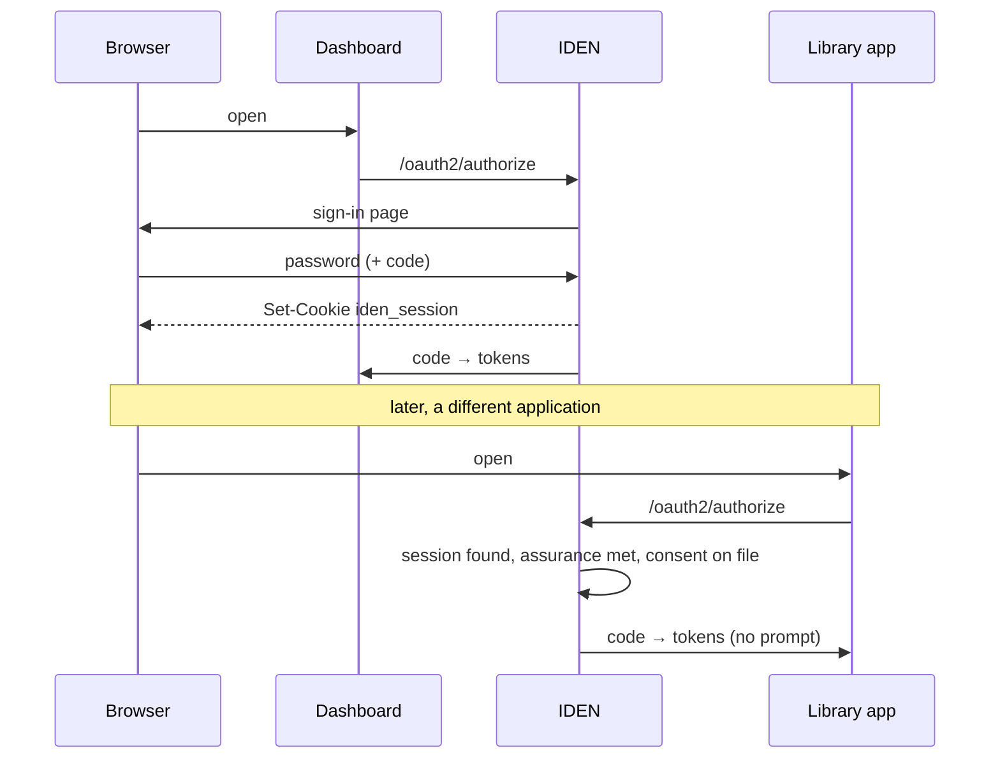

# Sessions and single sign-on

Single sign-on is not a feature layered on top of an identity provider. It is what one *is*.

## How it works

When someone signs in, IDEN sets a cookie in their browser: `iden_session`. That cookie is the
session, and it belongs to IDEN — not to any application.

The library app never talks to the dashboard. Neither knows the other exists. The only shared thing
is the cookie, and only IDEN can read it.

## What an application can ask for

The redirect to `/oauth2/authorize` can carry instructions about *how* the sign-in should behave.

| Parameter | Effect |
|---|---|
| `prompt=none` | Never show anything. Either return a code, or return an error saying why not. This is how a browser app checks silently whether someone is still signed in — typically in a hidden iframe, so nothing flashes on screen. |
| `prompt=login` | Make them authenticate again, even though a session exists. For a checkout page, or a settings screen. |
| `prompt=consent` | Ask for agreement again, even if it is already on file. |
| `prompt=select_account` | Treated as `login`. IDEN holds one account per session, so there is nothing to choose between; the value is accepted rather than refused, so a standards-compliant client is not broken by it. |
| `max_age=N` | Only accept a sign-in from within the last N seconds. `max_age=0` means *authenticate right now*. |
| `login_hint` | Pre-fill the email box. A suggestion — the password still decides who signs in. |
| `id_token_hint` | "I believe this person is signed in." If it names someone else, IDEN treats the session as absent. |

!!! tip "`prompt=none` never creates anything"
    When it refuses, it refuses before writing anything down. A pending sign-in left in storage for
    an interaction that will never happen is both a leak and a false record of what took place.

## `sid`, and why it is not the cookie

Every ID token carries a `sid` claim naming the session. It is a **hash** of the session id, never
the id itself.

The distinction matters enormously. The session id *is* the cookie — a bearer credential, and anyone
holding it is that person. Publishing it to every application in every ID token would hand each of
them, and anyone who read a token in transit, the ability to become the user.

The hash names the session without being usable as one.

## Signing out

Ending IDEN's own session is one line of code. The half that makes "sign out" mean anything is
telling the applications, because each keeps its own session and will happily go on serving the user
until something says otherwise.

`GET /oauth2/logout` does three things, in order:

1. **Revokes the refresh tokens that session produced.** Otherwise a signed-out application keeps
   minting access tokens indefinitely from a token it already holds.
2. **Delivers a logout token** to every application that registered a back-channel URL *and* was
   actually signed into during this session. IDEN records which those were as the session goes,
   because nothing else remembers.
3. **Clears the session and the cookie**, then redirects back to the application.

A logout token is a signed JWT carrying an `events` claim and **no `nonce`** — both rules exist so it
cannot be replayed as proof that someone just authenticated. IDEN enforces the reverse too: a token
carrying `events` is refused as an `id_token_hint`, so the message telling an application to sign
someone out cannot be turned around as evidence that they are signed in.

Delivery is best-effort with a five-second timeout and is **not** retried into a queue: an
unreachable application will re-validate at its next token exchange anyway. Every attempt is audited
with its outcome, so a sign-out that did not arrive somewhere is visible afterwards.

To implement the receiving end, see [Handle single sign-out](../guides/single-sign-out.md).

!!! note "Signing out is per browser, not per person"
    Sarah's phone stays signed in when she signs out on her laptop. That is deliberate — revocation
    is by session. To end every session at once, an administrator can revoke everything for a user,
    and changing a password does it automatically.

## Sessions are visible to their owner

`GET /entity/sessions` lists where someone is signed in, with the applications each session reached,
and `DELETE /entity/sessions/{id}` ends one — with the same fan-out as signing out normally. Sessions
are named by their public id, and ending one checks ownership, because a public id is not a
credential and holding one implies nothing.
