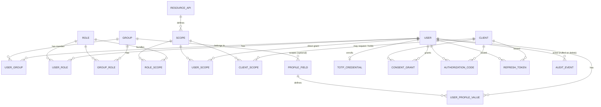

# Data model

One source of truth: `provider/src/provider/shared/models.py`.

Sessions, pending sign-ins, the token denylist, and rate-limit counters are deliberately **absent** —
they live in Redis under a TTL, because they are ephemeral and expiry should be the storage layer's
job rather than a cleanup job's.

## Tables

| Table | Holds |
|---|---|
| `users` | People. |
| `groups`, `user_groups` | Flat membership — groups do not nest. |
| `roles`, `role_scopes` | Named permission bundles. |
| `user_roles`, `group_roles`, `user_scopes` | The three routes a permission reaches a person by. |
| `resource_apis`, `scopes` | Registered backends and the permissions they define. |
| `clients`, `client_scopes` | Applications, and what each may request or holds outright. |
| `authorization_codes` | Single-use, 60 seconds. |
| `refresh_tokens` | Rotating, with lineage for reuse detection. |
| `consent_grants` | What each person agreed to give each application. |
| `totp_credentials` | Authenticator secrets. Unconfirmed until a code is verified. |
| `profile_fields`, `user_profile_values` | The organization's own schema, and the answers. |
| `audit_events` | Append-only. |

## Invariants worth knowing

| Invariant | Why |
|---|---|
| System rows cannot be renamed or deleted | Deleting `admin:roles:write` would lock the organization out permanently. |
| Codes, refresh tokens, session ids, and client secrets are stored **hashed** | A database read must never yield a usable credential. |
| Scope values are globally unique | A token carries permissions as bare strings and resolves the audience from the value; two APIs sharing one would blend their audiences into a single token. |
| `sid` is a hash of the session id | The id itself is the cookie. Publishing it would let any application become the user. |
| `AuthorizationCode.authenticated_at` is the *session's*, not the code's | `auth_time` is what `max_age` is measured against. Taking it from the code would make every SSO session look freshly authenticated. |
| A profile value copies its field's `unique` flag | An index predicate cannot reach into another table, so the partial unique index needs the flag on the row it indexes. |
| `AuditEvent.actor_user_id` is nulled on delete, not cascaded | Deleting a user must not erase what they did. Their email is copied onto the row for the same reason. |
| Groups do not nest | Recursive resolution is hard to explain, hard to audit, and hard to make fast. Flat membership covers the real cases. |
| No `tenant_id` on any table | IDEN is single-organization by design. |

## What Redis holds

| Key | Lifetime |
|---|---|
| `session:{hash}` | Sliding, 24 hours |
| `session_clients:{hash}` | With the session — which applications it reached |
| `challenge:{hash}` | 10 minutes — a pending sign-in or consent page |
| `denylist:{jti}` | Until the access token would have expired |
| `refresh_replay:{hash}` | 30 seconds — see [refresh rotation](../concepts/tokens.md#the-honest-double-use-problem) |
| `password_reset:{hash}` | 15 minutes, single use |
| `ratelimit:{bucket}:{identity}` | The window |
