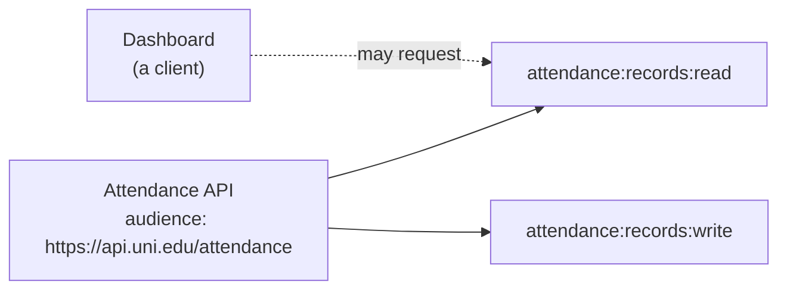
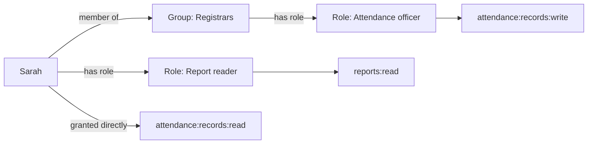

# Identity and access

Everything in IDEN is built from five nouns. Learn these and the rest of the system reads easily.

| Noun | What it is | Example |
|---|---|---|
| **User** | A person. | `sarah@university.edu` |
| **Group** | A set of people, for assigning permissions in bulk. | *Registrars* |
| **Role** | A named bundle of permissions. | *Attendance officer* |
| **Scope** | One permission. The smallest unit. | `attendance:records:read` |
| **API** | A backend that trusts IDEN, and owns the scopes that apply to it. | *Attendance service* |

A **client** is the sixth, slightly apart: an application that asks IDEN for tokens. It is not a
person and holds no permissions of its own unless it is a machine client.

## Scopes belong to an API, not to an application

This is the piece that surprises people, and it is worth getting right early.

A scope like `attendance:records:read` is defined by the **attendance service**, because the
attendance service is the thing that decides what "read records" means and enforces it. The dashboard
that displays attendance does not define that permission — it *requests* it.



Two consequences follow:

- **A token names its audience.** Tokens IDEN issues for attendance scopes are addressed to the
  attendance service, and no other service will accept them. A stolen dashboard token is useless
  against your payroll system.
- **Scope values are globally unique.** Two APIs cannot both define `records:read`, because a token
  carries scopes as bare strings and the audience is worked out from the value. Namespace yours:
  `attendance:records:read`.

## How a person ends up with a permission

Three routes, and they add together.



Sarah's **effective permissions** are the union of all three paths:
`attendance:records:write` (via her group's role), `reports:read` (via her own role), and
`attendance:records:read` (granted to her personally).

Direct grants exist for exceptions — the one person who needs one extra thing, where inventing a role
for them would be worse. Reach for roles and groups first; they are what you will still understand in
six months.

You can always ask where a permission came from: `GET /entity/permissions` tells the person,
`GET /admin/users/{id}/effective-scopes` tells an administrator. Both use the same code, so they
cannot disagree.

## What actually ends up in a token

Not everything Sarah is allowed to do. The token an application receives carries the **intersection**
of three things:

```
what the application asked for
  ∩ what the application is allowed to ask for
  ∩ what Sarah actually holds
```

Anything outside that is dropped **silently**, not refused. If the dashboard asks for
`attendance:records:write` and Sarah does not have it, she still signs in — her token simply does not
carry it, and the attendance API will refuse that action. Failing the whole sign-in instead would
mean an application asking for one optional extra permission locks out everyone who lacks it.

!!! note "Permissions change at the next token, not instantly"
    Access tokens are self-contained and short-lived (ten minutes by default). Revoking a role stops
    it being *issued* immediately, but a token already in flight keeps working until it expires. That
    is the trade that lets your APIs validate tokens without calling IDEN on every request. When
    revocation must be immediate, see [the denylist](tokens.md#revoking-a-token-early).

## System permissions are protected

IDEN's own permissions — everything under `admin:` and `entity:` — are marked as system-defined and
cannot be renamed or deleted through the API.

Without that guard, an administrator could delete `admin:roles:write` and lock the organization out
of its own deployment permanently, with no way back in short of editing the database by hand.

Your own APIs, scopes, and roles carry no such flag and are fully yours to change.
